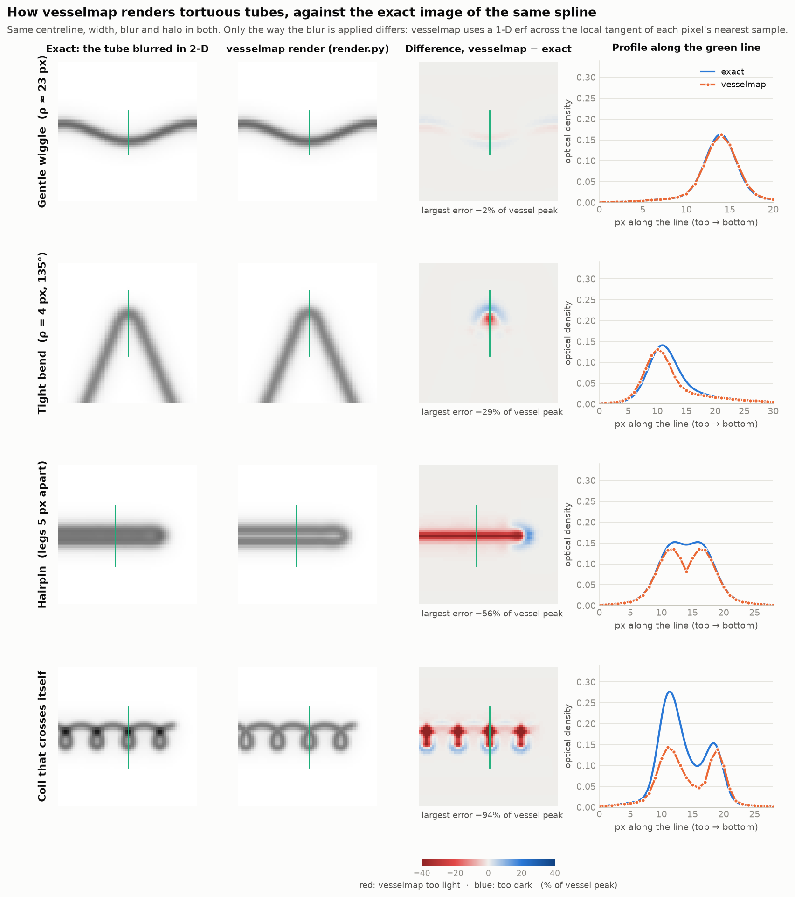
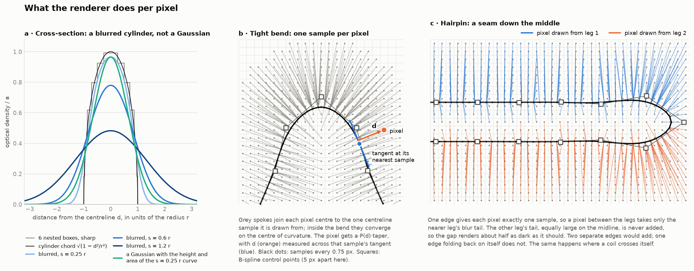
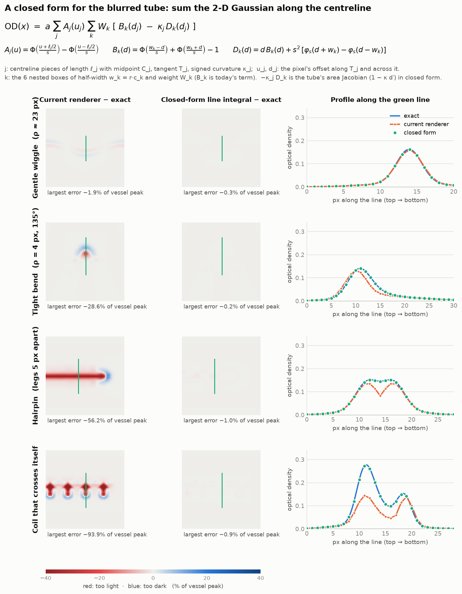
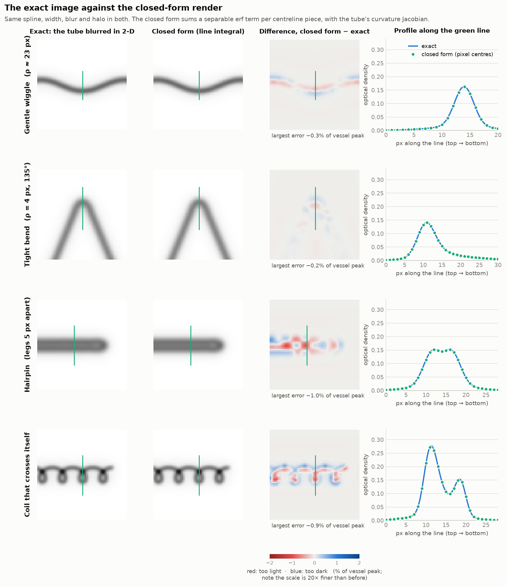
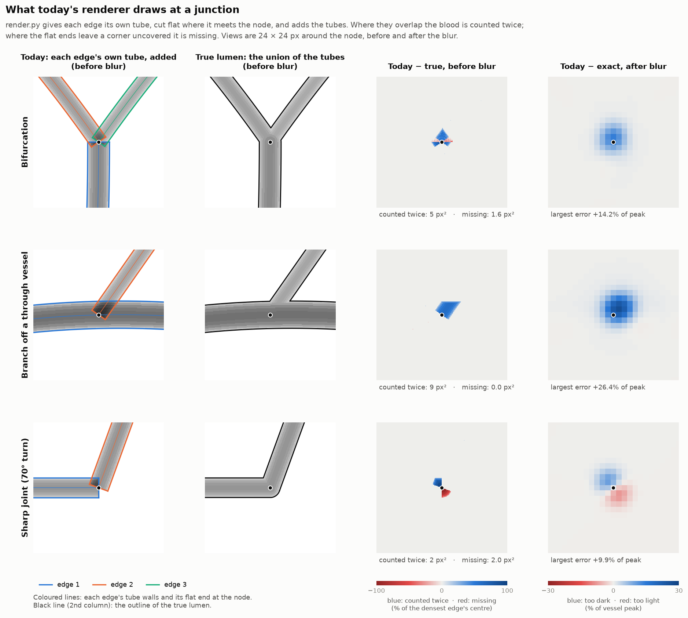
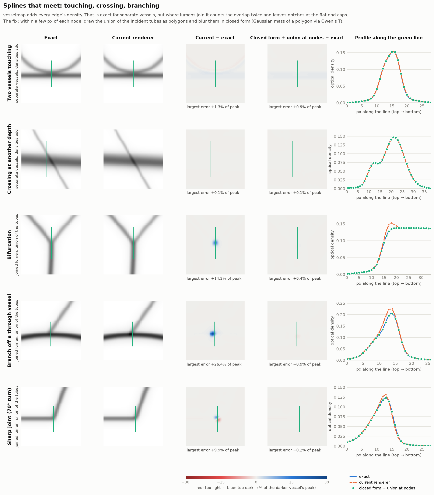

# Rendering tortuous vessels and junctions exactly

**Status: to do. Implement this in future annotation workflows.** The
renderer in `vesselmap/render.py` is inexact in tight bends, in hairpins
and coils, and at every junction. This study measures that error and gives
closed-form fixes, checked against exact images. The fixes belong in
`NetworkModel`, and so in every step that fits or draws the model: `map`,
`refine`, `faint`, `consolidate` (and the image test `flow` borrows from
it), `fit-frames`, and the model and residual figures. `synthetic.py` needs
the junction fix too (see *Synthetic scenes* below). Nothing here changes
the current code: the scripts in this folder only measure it.

All tests use synthetic tubes, 64 × 64 px, rendered through the real
`NetworkModel`. Each is compared with the exact image of the same fitted
spline: the same 6-box cross-section, drawn sharp on a 1/8 px grid and
blurred with a true 2-D Gaussian and the same halo. Errors are the largest
difference in a crop, as a percentage of the vessel's peak optical density.

## 1. Tortuous vessels

**Today.** For each edge, every pixel within reach is paired with its one
nearest centreline sample. It gets the profile of a straight tube in that
sample's tangent frame: a 1-D erf across the tangent, times the end-cap
taper (`_associate`, `_entry_core`). Two things follow:

* In a bend, the blur is taken across a straight tube. The inside of a
  tight bend renders too light, the outside slightly too dark.
* One sample per pixel per edge means other parts of the same edge are
  never added. Between the legs of a hairpin only the nearer leg's blur
  tail counts, so the gap renders about half as dark as it should. Where a
  coil crosses itself (at another depth) the crossing is not darker at all.

| tube | today |
|---|---|
| gentle wiggle, radius of curvature ρ ≈ 23 px | 1.9 % |
| tight bend, ρ = 4 px, r = 1.5, s = 2 | 28.6 % |
| hairpin, legs 5 px apart | 56.2 % |
| coil that crosses itself | 93.9 % |




**Fix: sum the 2-D Gaussian along the centreline.** Split the centreline
into short pieces j (length ℓ_j, midpoint C_j, unit tangent T_j, signed
curvature κ_j with dT/ds = κN). For a pixel at offset u_j along T_j and
d_j across it, with the 6 boxes k (half-width w_k = r·c_k, weight W_k):

```
OD(x) = a · Σ_j A_j(u_j) · Σ_k W_k · [ B_k(d_j) − κ_j · D_k(d_j) ]

A_j(u) = Φ((u + ℓ_j/2)/s) − Φ((u − ℓ_j/2)/s)
B_k(d) = Φ((w_k − d)/s) + Φ((w_k + d)/s) − 1                 (today's term)
D_k(d) = d·B_k(d) + s²·[φ_s(d + w_k) − φ_s(d − w_k)]
```

Φ is the normal CDF and φ_s the Gaussian density of standard deviation s.

Why it is exact:

1. In tube coordinates x = C(s) + d′N(s) the area element is
   (1 − κ d′) ds dd′.
2. An isotropic 2-D Gaussian factorises in any rotated frame, so at each s
   it is φ_s(along) · φ_s(across).
3. With the box cross-section, the across integral including the Jacobian
   is B_k − κ D_k exactly (D_k is the first moment of a truncated Gaussian).
4. Treating each piece as straight gives A_j. That is exact for a straight
   piece of any length; on curved pieces the error falls with ℓ².

Every piece within reach contributes, so the legs of a hairpin and the
strands of a coil add. On a straight tube the sum reduces to today's
formula, so nothing changes where the renderer is already right.

| tube | today | sum without −κD | closed form |
|---|---|---|---|
| gentle wiggle | 1.9 % | 0.8 % | 0.2–0.3 % |
| tight bend | 28.6 % | 5.1 % | 0.2 % |
| hairpin | 56.2 % | 8.3 % | 1.0 % |
| coil | 93.9 % | 8.6 % | 0.9 % |

The curvature term matters: without it tight bends stay 5–9 % off. A
cheaper variant that keeps one sample per pixel and expands the osculating
circle to second order fails: it diverges near the centre of a tight turn
(130–400 %).




## 2. Splines that meet

**Today.** `vessel_image` adds every edge's density. That is right for
separate vessels: two vessels touching side by side (1.3 %, mostly the
reference grid) and a crossing at another depth (0.1 %). It is wrong where
lumens join. There the blood is the union of the tubes, and for tubes whose
axes lie at one depth the chord through the union is the *largest* chord,
not the sum. Each edge's tube also ends flat at the node, square to its own
axis. So overlaps are counted twice and outer corners are missing:

| junction | counted twice | missing | today, after blur |
|---|---|---|---|
| bifurcation | 5 px² | 1.6 px² | +14.2 % |
| branch leaving a through vessel | 9 px² | 0 | +26.4 % |
| sharp 70° joint (degree-2 node) | 2 px² | 2.0 px² | +9.9 % |



**Fix: draw the union near each node.** Within R of each node (until the
incident tubes stop overlapping, R ≈ 1.25·(w_i + w_j)/sin θ_ij, capped),
take those pieces out of the sum above. Instead, for each density level of
the box staircases, draw the union of the incident tubes as one polygon:
each tube's stretch as quads between its normals, plus a round cap at the
node. The 2-D Gaussian mass of a polygon has a closed form, summed over its
sides AB:

```
G_s * 1_polygon (x) = Σ_sides sign(A × B) · [ g(h, t_B) − g(h, t_A) ]
g(h, t) = atan(t)/2π − T(h, t)          T = Owen's T function
```

with A, B relative to the pixel and scaled by 1/s, h the distance to the
line AB, and t_A, t_B the positions of A and B along that line divided by
h. On a square this matches the separable erf product to 6 decimals.

| junction | today | per-edge closed form | + union at nodes |
|---|---|---|---|
| bifurcation | 14.2 % | 14.2 % | 0.4 % |
| branch leaving a through vessel | 26.4 % | 26.3 % | 0.9 % |
| sharp 70° joint | 9.9 % | 9.9 % | 0.2 % |



## Implementing it in render.py

* **Pairs instead of one nearest sample.** At `rebuild`, associate each
  pixel with every piece within reach (|d| < r + 4s, u within the piece
  ± 4s) instead of the nearest sample. There is no nearest-sample seam any
  more, and the image is smooth in the control points.
* **Pieces by curvature.** Pieces short where the spline bends (sagitta
  κℓ²/8 ≤ 0.02 px) and long where it is straight (0.75–8 px here; straight
  pieces are exact at any length, so the cap can grow with the blur for
  strongly blurred vessels). κ comes from a second-derivative design matrix,
  so everything stays differentiable.
* **Clamp curvature.** The Jacobian needs |κ|·r < 1 (a real vessel cannot
  fold tighter than its radius); clamp κ so the fit cannot break it.
* **Node polygons.** Compute the union's topology at `rebuild`, like the
  pixel association. The vertices are intersections of lines and arc
  points, so they stay differentiable in positions and widths. PyTorch has
  no Owen's T: use Gauss–Legendre quadrature of its 1-D integral
  T(h, a) = (1/2π) ∫₀ᵃ exp(−h²(1 + x²)/2) / (1 + x²) dx.
* **Halo** stays the image-wide blur of the vessel image.
* **Cost.** On these tubes the (pixel, piece) pairs are 3.5× today's
  (pixel, edge) entries on straight vessels, 8–11× on bends and hairpins,
  18× on the coil, at about 1.9× the arithmetic per pair: roughly 7–35× the
  renderer's compute and memory. Not yet measured on a real map, where most
  centreline is gentle. Node polygons touch only pixels near nodes.
* Put both behind a switch and compare `synth-eval` recall, precision and
  run time before making it the default.

## Synthetic scenes

`synthetic.render` also adds vessels (`od += ...`), and its branches start
on the parent's centreline. Its ground truth therefore double-counts at
every branch point, just like today's renderer, and `synth-eval` cannot
see the junction error. Render the ground truth with the union at branch
points when the renderer changes.

## Caveats

* Synthetic tubes only; not yet tried on the reference frames.
* Junctions assume contrast proportional to radius (the same blood) and one
  blur for all tubes at a node (the node region uses their mean). The model
  fits contrast and blur per edge; the union still takes the largest
  density, but that case is untested.
* Two vessels at one depth that merge without a node are still added. One
  image cannot tell such a merge from a crossing.
* The exact reference is itself good to about 0.1–0.4 % (it moves by that
  much when its grid is refined).

## Reproduce

```bash
pip install -r requirements-vesselmap.txt shapely
python vesselmap/render_study/render_figures.py       # today's renderer (figures 1, 2)
python vesselmap/render_study/closed_form_check.py    # tortuous tubes: all variants
python vesselmap/render_study/fig_closed_form.py
python vesselmap/render_study/fig_exact_vs_closed.py
python vesselmap/render_study/junction_check.py       # contact, crossing, junctions
python vesselmap/render_study/fig_junctions.py
python vesselmap/render_study/fig_old_junctions.py
```

Each script takes under two minutes on CPU and writes to `figures/`.
